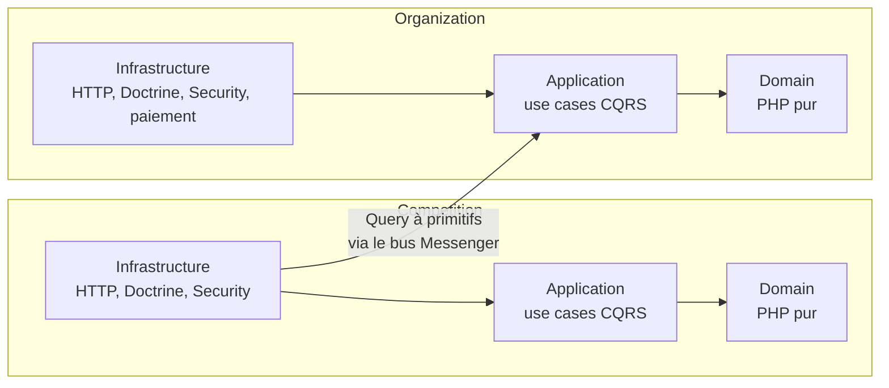

# Foot Contest

Application SaaS multi-tenant de gestion de tournois de football, destinée aux entreprises, associations et mairies.

Une organisation (le client) crée ses compétitions. Les capitaines y inscrivent leur équipe, les joueurs la rejoignent, puis l'organisateur clôt les inscriptions et génère le tableau.

## Parcours d'une compétition

1. L'organisateur crée la compétition : format, jauge d'équipes, effectif minimum par équipe.
2. Chaque capitaine inscrit son équipe, seul. L'effectif se compose ensuite par demandes d'adhésion, que le capitaine accepte ou refuse.
3. L'organisateur clôt les inscriptions. La clôture est refusée tant qu'une équipe est sous l'effectif minimum ; la réponse liste alors les équipes incomplètes.
4. L'organisateur génère le tableau (élimination directe). Les exemptions sont résolues à la génération.

Le vocabulaire métier est défini dans le [glossaire](docs/glossary.md).

## Acteurs

| Rôle | Responsabilité |
|------|----------------|
| Organisateur | Crée et gère le tournoi |
| Capitaine | Inscrit et gère une équipe (est aussi joueur) |
| Joueur | Rejoint une équipe pour un tournoi |

## Stack

- PHP 8.4 / Symfony 8.1
- PostgreSQL (Doctrine ORM)
- PHPUnit 13
- Docker Compose pour l'environnement de développement et la CI (GitHub Actions)

## Architecture

Deux bounded contexts, `Competition` et `Organization`, chacun en architecture hexagonale (`Domain`, `Application`, `Infrastructure`). La dépendance entre modules est à sens unique, vérifiée par [Deptrac](deptrac.yaml) en CI.



Les conventions détaillées (par couche, autorisation, erreurs HTTP, tests) sont dans [`docs/architecture.md`](docs/architecture.md).

## Choix structurants

Chaque décision est documentée dans [`docs/adr/`](docs/adr/) : contexte, alternatives rejetées, conséquences. Quelques points d'entrée :

- **Agrégats riches plutôt que modèle anémique** : `Bracket` est l'unique point de mutation du tableau, sans service séparé ([ADR 004](docs/adr/004-bracket-aggregate-root-sans-service-separe.md)).
- **CQRS avec Symfony Messenger**, une couche Application en PHP pur, sans dépendance au framework ([ADR 008](docs/adr/008-application-cqrs-messenger.md), [ADR 025](docs/adr/025-tag-messenger-handlers-par-resource.md)).
- **Frontières entre modules** : pas de Shared Kernel, les appels inter-modules passent par une Query à primitifs ([ADR 027](docs/adr/027-organization-bounded-context-auth-paiement.md), [ADR 029](docs/adr/029-competition-organization-id.md)).
- **Sécurité** : JWT stateless, identité de l'acteur toujours lue dans le token, réponses anti-énumération sur les endpoints publics ([ADR 024](docs/adr/024-create-player-anti-enumeration.md), [ADR 030](docs/adr/030-withdraw-double-acteur.md)).
- **Erreurs métier traduites en HTTP** par des listeners globaux, jamais par un `try/catch` de contrôleur ([ADR 015](docs/adr/015-mapping-erreurs-metier-http.md), [ADR 031](docs/adr/031-listener-not-authorized-unifie.md)).
- **Règle métier à plusieurs conséquences** : l'effectif minimum par équipe, de la création de la compétition à la réponse HTTP de la clôture ([ADR 043](docs/adr/043-effectif-minimum-par-equipe.md)).

## Qualité

- TDD strict : un comportement à la fois, red-green-refactor. Chaque couche teste sa propre API publique, sans dupliquer les règles couvertes par la couche qu'elle délègue.
- PHPStan au niveau max sur `src/` et `tests/`, sans baseline ([ADR 018](docs/adr/018-phpstan-analyse-statique.md), [ADR 038](docs/adr/038-phpstan-baseline-resorption.md)).
- PHP-CS-Fixer et Deptrac exécutés en CI, avec les tests, sur chaque pull request.
- Une pull request par incrément de feature, de l'intérieur vers l'extérieur, `main` toujours verte ([ADR 042](docs/adr/042-une-pr-par-increment-de-feature.md)).

## Développement assisté par IA

Le dépôt est développé avec un assistant de code, dans un cadre écrit par [`AGENTS.md`](AGENTS.md) : TDD strict, validation de l'approche avant toute implémentation structurante, ADR pour chaque décision impactante, une itération validée à la fois. Les garde-fous (tests, PHPStan, Deptrac, protection de `main`) s'appliquent comme pour tout contributeur.

## Installation

Seul Docker est requis (pas de PHP/Composer local nécessaire) — voir [ADR 011](docs/adr/011-environnement-docker.md).

```bash
docker compose up -d app
```

La paire de clés JWT (`config/jwt/*.pem`) n'est pas versionnée (voir `.gitignore`) — à générer une fois après le premier démarrage :

```bash
docker compose exec app php bin/console lexik:jwt:generate-keypair
```

## Lancer les tests

```bash
# Tous les tests
docker compose exec app vendor/bin/phpunit

# Un fichier spécifique
docker compose exec app vendor/bin/phpunit tests/Competition/Domain/SingleEliminationBracketGeneratorTest.php

# Un test spécifique
docker compose exec app vendor/bin/phpunit --filter testMethodName
```

## Raccourcis

Un `Makefile` raccourcit les commandes `docker compose` les plus courantes — `make help` liste les cibles disponibles (`make test`, `make stan`, `make cs-fix`, etc.).

## Documentation

- [Issues/Milestones GitHub](https://github.com/Smash68/foot-contest/issues) — avancement et prochaines features (voir [ADR 037](docs/adr/037-github-issues-milestones.md))
- [`docs/adr/`](docs/adr/) — décisions d'architecture (ADR)
- [`docs/architecture.md`](docs/architecture.md) — conventions d'architecture
- [`docs/glossary.md`](docs/glossary.md) — langage métier
- [`AGENTS.md`](AGENTS.md) — commandes et workflow de développement (instructions pour les agents de code et les contributeurs)

## Licence

Projet sous [licence MIT](LICENSE).
